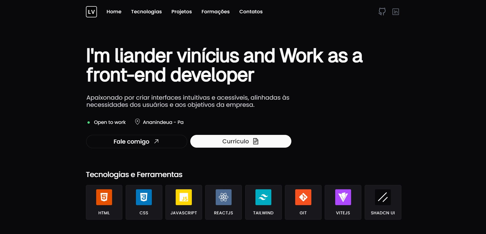

## Meu Portfólio

Este portfólio foi desenvolvido para mostrar minhas habilidades em desenvolvimento web e projetos realizados ao longo da minha jornada com Desenvolvedor Front-end. 

## Link para acessar o portfólio

Você pode acessar meu portfólio ao vivo através do seguinte link:
[https://lianderdev-portfolio.vercel.app/](https://lianderdev-portfolio.vercel.app/)

## Tecnologias Utilizadas

- **HTML**: Estrutura básica do site.
- **CSS**: Estilização e layout responsivo.
- **JavaScript**: Interatividade e funcionalidades dinâmicas.
- **React**: Biblioteca JavaScript para construção de interfaces de usuário.
- **Tailwind CSS**: Framework CSS para estilização rápida e eficiente.
- **ShadCN UI**: Biblioteca de componentes UI que oferece um conjunto de elementos estilizados e prontos para uso.
- **Email.js**: Para envio de mensagens através do formulário de contato.

## Seções

- **Home**: Uma visão geral de quem sou e do que faço.
- **Projetos**: Exibição de meus projetos com descrições e links.
- **Sobre Mim**: Informações pessoais e profissionais.
- **Contato**: Formulário para que visitantes possam entrar em contato comigo.

## Responsividade e Acessibilidade

O portfólio foi projetado com uma abordagem responsiva, garantindo que ele funcione bem em dispositivos móveis, tablets e desktops. 

## Imagem do Projeto

